```mermaid
%% Business Model Canvas for RetireeCorp
%% Refined and polished from Project NeverTiree
flowchart TB

    %% Key Partners
    subgraph KeyPartners["Key Partners"]
        KP1[Retiree Organizations & Associations]
        KP2[Universities & Lifelong Learning Institutions]
        KP3[Corporate Clients Seeking Advisory]
        KP4[Tech Platforms & Portal Providers]
    end

    %% Key Activities
    subgraph KeyActivities["Key Activities"]
        KA1[Curate Retiree Knowledge & Notes]
        KA2[Manage Authenticated Portal]
        KA3[Community Engagement & Events]
        KA4[Advisory & Mentorship Programs]
        KA5[Content Creation for Learning Paths]
        KA6[Governance & Ethical Compliance]
    end

    %% Key Resources
    subgraph KeyResources["Key Resources"]
        KR1[RetireeExpert Community]
        KR2[Retiree_Corp Repository Notes]
        KR3[Web Platform & Portal]
        KR4[Governance Frameworks]
        KR5[Learning Materials & Templates]
    end

    %% Value Propositions
    subgraph ValuePropositions["Value Propositions"]
        VP1[Meaningful Work Beyond Retirement]
        VP2[Structured Knowledge Sharing & Mentorship]
        VP3[Ethical, Governance-Aligned Engagement]
        VP4[Curated Portal with Retiree_Corp Insights]
        VP5[Lifelong Learning & Cross-Domain Exploration]
        VP6[Recognition of Retiree Contributions]
    end

    %% Customer Relationships
    subgraph CustomerRelationships["Customer Relationships"]
        CR1[Personalized Matching for Mentorship & Advisory]
        CR2[Community Support & Peer Discussions]
        CR3[Recognition & Milestone Programs]
        CR4[Portal Access & Feedback Loops]
    end

    %% Channels
    subgraph Channels["Channels"]
        CH1[Website & Landing Pages]
        CH2[Authenticated Portal]
        CH3[Email & Newsletter]
        CH4[Webinars & Online Workshops]
        CH5[Social Media & Professional Networks]
    end

    %% Customer Segments
    subgraph CustomerSegments["Customer Segments"]
        CS1[Retired Professionals Seeking Purposeful Work]
        CS2[Organizations Seeking Advisory & Mentorship]
        CS3[Educational Institutions & Lifelong Learners]
        CS4[AI & Tech Teams Seeking Experienced Advisors]
    end

    %% Cost Structure
    subgraph CostStructure["Cost Structure"]
        C1[Platform Development & Maintenance]
        C2[Portal Hosting & Tech Infrastructure]
        C3[Content Curation & Learning Materials]
        C4[Community Engagement & Events]
        C5[Marketing & Outreach]
        C6[Governance & Compliance Activities]
    end

    %% Revenue Streams
    subgraph RevenueStreams["Revenue Streams"]
        R1[Membership Fees for Portal Access]
        R2[Consulting & Advisory Fees from Organizations]
        R3[Sponsored Learning Programs & Workshops]
        R4[Grants / Donations for Social Initiatives]
    end

    %% Connections
    KP1 --> KA1
    KP2 --> KA5
    KP3 --> KA4
    KP4 --> KA2

    KA1 --> VP2
    KA2 --> VP4
    KA3 --> CR2
    KA4 --> VP3
    KA5 --> VP5
    KA6 --> VP3

    KR1 --> VP1
    KR2 --> VP2
    KR3 --> VP4
    KR4 --> VP3
    KR5 --> VP5

    VP1 --> CS1
    VP2 --> CS1
    VP3 --> CS2
    VP4 --> CS1
    VP5 --> CS1
    VP6 --> CS1

    CR1 --> CS1
    CR2 --> CS1
    CR3 --> CS1
    CR4 --> CS1

    CH1 --> CS1
    CH2 --> CS1
    CH3 --> CS1
    CH4 --> CS1
    CH5 --> CS1

    C1 --> VP1
    C2 --> VP4
    C3 --> VP5
    C4 --> CR2
    C5 --> CS1
    C6 --> VP3

    R1 --> VP1
    R2 --> VP3
    R3 --> VP5
    R4 --> VP1
```

```mermaid
flowchart TD
    %% Public Website Pages
    A[Home] --> B[About]
    B --> B1[Mission & Values]
    B --> B2[Community Purpose]
    B --> B3[Core Principles]

    A --> C[Founder]
    C --> C1[Founder Story]
    C --> C2[Vision Behind RetireeCorp]
    C --> C3[Professional Background]

    A --> D[Join the Community]
    D --> D1[For Retirees]
    D --> D2[Eligibility & Guidelines]
    D --> D3[Sign Up]

    A --> E[Engagement]
    E --> E1[Mentorship Programs]
    E --> E2[Consultancy & Advisory]
    E --> E3[Projects & Opportunities]
    E --> E4[How It Works]

    A --> F[Learning]
    F --> F1[Learning Paths]
    F --> F2[Cross-Domain Exploration]
    F --> F3[Resources Library]

    A --> G[Policies]
    G --> G1[Governance]
    G --> G2[Ethics & AI Stewardship]
    G --> G3[Well-Being Practices]
    G --> G4[Decision-Making Frameworks]

    A --> H[Milestones & Recognition]
    A --> I[Blog & Insights]
    A --> J[FAQ]
    A --> L[Contact]

    %% CTA to Portal
    A --> P[Portal - Authenticated Users]
    D1 --> P
    E4 --> P
    F3 --> P

    %% Portal Flow
    P --> P1[Portal Home Dashboard]
    P1 --> P2[Knowledge Base]
    P1 --> P3[Learning Paths]
    P1 --> P4[Governance Templates]
    P1 --> P5[Mentorship & Advisory Tracker]
    P1 --> P6[Recognition & Milestones]
    P1 --> P7[Submit Feedback / Notes]

    %% Knowledge Base Subsections
    P2 --> P2a[Retiree_Corp Internal Notes]
    P2 --> P2b[Policies & Frameworks]
    P2 --> P2c[AI Collaboration Guidelines]

    %% Learning Paths Subsections
    P3 --> P3a[Cross-Domain Exploration]
    P3 --> P3b[Lifelong Learning Modules]
    P3 --> P3c[Recommended Resources]

    %% Mentorship Tracker Subsections
    P5 --> P5a[Assigned Mentorships]
    P5 --> P5b[Pending Requests]
    P5 --> P5c[Completed Advisory Projects]
```

# 🏗 RetireeCorp – Business Model Canvas

---

## 🔹 Canvas Section Summary

**Key Partners:** Retiree associations, universities, corporate clients, and tech platforms.
**Key Activities:** Knowledge curation, portal management, community events, mentorship/advisory, learning content, governance oversight.
**Key Resources:** Retiree community, Retiree_Corp notes, platform infrastructure, governance frameworks, learning materials.
**Value Propositions:** Purposeful work, structured mentorship, ethical engagement, portal access, lifelong learning, recognition programs.
**Customer Relationships:** Personalized matching, peer support, milestone recognition, portal feedback.
**Channels:** Website, authenticated portal, email, webinars, social media.
**Customer Segments:** Retirees, organizations, lifelong learners, tech/AI teams.
**Cost Structure:** Platform maintenance, content curation, community events, marketing, governance/compliance.
**Revenue Streams:** Memberships, consulting/advisory fees, sponsored programs, grants/donations.

---

# 🌐 RetireeCorp – Website & Portal Flow Diagram

---

## 🔹 Flow Summary

**Public Website:**

* Core pages: Home, About, Founder, Community, Engagement, Learning, Policies, Milestones, Blog, FAQ, Contact
* CTAs direct users to **portal registration/login**

**Portal (Authenticated Users):**

* **Dashboard** as main hub
* Sections: Knowledge Base (Retiree_Corp content), Learning Paths, Governance Templates, Mentorship/Advisory Tracker, Recognition & Milestones, Feedback/Notes
* Modular structure allows easy content addition

**Navigation Notes:**

* Public CTAs funnel members into the portal
* Retiree_Corp content is gated for authenticated users
* Sections are structured for **long-term scalability and cross-domain growth**

