# 🏗 RetireeCorp – Business Model Canvas

**Purpose:** This canvas captures RetireeCorp’s strategic business model, combining a purpose-driven digital ecosystem for retirees with a values-centered portal, learning environment, and advisory network.

```mermaid
%% RetireeCorp Business Model Canvas – 9-Box Layout
%% Classic structure (Key Partners → Key Activities → etc.)

graph TB
    style Canvas fill:#f8f9fa,stroke:#333,stroke-width:1px

    %% Boxes
    KP["**KEY PARTNERS**<br>• Retiree Associations & Professional Networks<br>• Universities & Lifelong Learning Institutions<br>• Corporate Clients Seeking Advisory<br>• Tech Platforms & Portal Providers"] 
    KA["**KEY ACTIVITIES**<br>• Curate Retiree Knowledge & Notes<br>• Manage Authenticated Portal<br>• Community Engagement & Events<br>• Advisory & Mentorship Programs<br>• Content Creation for Learning Paths<br>• Governance & Ethical Compliance"] 
    VP["**VALUE PROPOSITIONS**<br>• Meaningful Work Beyond Retirement<br>• Structured Knowledge Sharing & Mentorship<br>• Ethical, Governance-Aligned Engagement<br>• Curated Portal with Retiree_Corp Insights<br>• Lifelong Learning & Cross-Domain Exploration<br>• Recognition of Retiree Contributions"] 
    CR["**CUSTOMER RELATIONSHIPS**<br>• Personalized Matching for Mentorship & Advisory<br>• Community Support & Peer Discussions<br>• Recognition & Milestone Programs<br>• Portal Access & Feedback Loops"] 
    CS["**CUSTOMER SEGMENTS**<br>• Retired Professionals Seeking Purposeful Work<br>• Organizations Seeking Advisory & Mentorship<br>• Educational Institutions & Lifelong Learners<br>• AI & Tech Teams Seeking Experienced Advisors"] 
    CH["**CHANNELS**<br>• Website & Landing Pages<br>• Authenticated Portal<br>• Email & Newsletter<br>• Webinars & Workshops<br>• Social Media & Professional Networks"] 
    KR["**KEY RESOURCES**<br>• RetireeExpert Community<br>• Retiree_Corp Repository Notes<br>• Web Platform & Portal<br>• Governance Frameworks<br>• Learning Materials & Templates"] 
    COST["**COST STRUCTURE**<br>• Platform Development & Maintenance<br>• Portal Hosting & Tech Infrastructure<br>• Content Curation & Learning Materials<br>• Community Engagement & Events<br>• Marketing & Outreach<br>• Governance & Compliance Activities"] 
    REV["**REVENUE STREAMS**<br>• Membership Fees for Portal Access<br>• Consulting & Advisory Fees from Organizations<br>• Sponsored Learning Programs & Workshops<br>• Grants / Donations for Social Initiatives"]

    %% Layout Connections for alignment
    KP --- KA
    KA --- VP
    VP --- CR
    CR --- CS
    VP --- CH
    KA --- KR
    VP --- REV
    COST --- REV
```

---

## 🔹 Detailed Explanation of Each Canvas Component

### **1. Key Partners**

These are strategic collaborators enabling RetireeCorp to thrive:

* **Retiree Associations & Professional Networks** – Recruit experienced retirees and co-host mentoring events.
* **Universities & Lifelong Learning Institutions** – Provide educational frameworks, certification pathways, and guest speaker opportunities.
* **Corporate Clients Seeking Advisory** – Organizations looking for advisory, governance input, or mentorship for internal teams.
* **Tech Platforms & Portal Providers** – Ensure portal stability, secure authentication, and integrated collaboration tools.

---

### **2. Key Activities**

The operational backbone:

* **Curate Knowledge & Notes** – Maintain Retiree_Corp repository and internal wisdom.
* **Manage Authenticated Portal** – Keep the secure portal functional, updated, and accessible.
* **Community Engagement & Events** – Host webinars, networking sessions, and recognition programs.
* **Advisory & Mentorship Programs** – Match retirees to organizations or learners for structured guidance.
* **Content Creation for Learning Paths** – Develop cross-domain learning modules, AI collaboration guides, and lifelong learning content.
* **Governance & Ethical Compliance** – Maintain ethical standards, AI stewardship, and decision-making frameworks.

---

### **3. Key Resources**

Critical assets fueling the ecosystem:

* **RetireeExpert Community** – Skilled retirees with domain expertise.
* **Retiree_Corp Repository Notes** – Internal knowledge, frameworks, and templates.
* **Web Platform & Portal** – Technology infrastructure supporting collaboration.
* **Governance Frameworks** – Policies, ethical standards, and compliance documentation.
* **Learning Materials & Templates** – Structured content for learning paths, workshops, and cross-domain exploration.

---

### **4. Value Propositions**

What RetireeCorp delivers to its members and clients:

* **Meaningful Work Beyond Retirement** – Engage retirees in purposeful work without sacrificing well-being.
* **Structured Knowledge Sharing & Mentorship** – Organized pathways for experience transfer.
* **Ethical, Governance-Aligned Engagement** – All contributions follow professional ethics and AI stewardship.
* **Curated Portal with Retiree_Corp Insights** – Members access secure internal notes, templates, and best practices.
* **Lifelong Learning & Cross-Domain Exploration** – Structured learning and reflective growth opportunities.
* **Recognition of Retiree Contributions** – Celebrate member contributions with milestones, badges, and public acknowledgment.

---

### **5. Customer Relationships**

How RetireeCorp maintains engagement and trust:

* Personalized matching for mentorship and advisory programs.
* Community support through discussion forums, webinars, and networking.
* Recognition programs that reward engagement and contribution.
* Feedback loops via the portal, allowing iterative improvement of content and experience.

---

### **6. Channels**

How RetireeCorp reaches its audience:

* **Website & Landing Pages** – Informational hub and registration portal.
* **Authenticated Portal** – Central dashboard for members, content access, and engagement tracking.
* **Email & Newsletter** – Updates, announcements, and learning highlights.
* **Webinars & Online Workshops** – Interactive, structured learning opportunities.
* **Social Media & Professional Networks** – Awareness, recruitment, and thought leadership.

---

### **7. Customer Segments**

Target audiences:

* Retired professionals seeking purposeful, flexible work.
* Organizations needing advisory, mentorship, and project guidance.
* Universities, lifelong learners, and training programs requiring expert guidance.
* Tech and AI teams needing experienced domain and governance advisors.

---

### **8. Cost Structure**

Major expenditures:

* Platform development, UI/UX design, and maintenance.
* Hosting and IT infrastructure for secure portal access.
* Content curation and production for learning modules and guides.
* Community engagement, workshops, and recognition events.
* Marketing, outreach, and partnership cultivation.
* Governance, compliance, and moderation efforts.

---

### **9. Revenue Streams**

How RetireeCorp generates income while sustaining purpose:

* Membership fees for portal and learning path access.
* Consulting and advisory fees charged to organizations for structured engagements.
* Sponsored learning programs, webinars, and workshops.
* Grants or donations supporting social purpose initiatives.

---

# 🌐 RetireeCorp – Website & Portal Flow Diagram

---

## 🔹 Flow Summary

**Public Website:**

* Core pages: Home, About, Founder, Community, Engagement, Learning, Policies, Milestones, Blog, FAQ, Contact
* CTAs direct users to **portal registration/login**

**Portal (Authenticated Users):**

* **Dashboard** as main hub
* Sections: Knowledge Base (Retiree_Corp content), Learning Paths, Governance Templates, Mentorship/Advisory Tracker, Recognition & Milestones, Feedback/Notes
* Modular structure allows easy content addition

**Navigation Notes:**

* Public CTAs funnel members into the portal
* Retiree_Corp content is gated for authenticated users
* Sections are structured for **long-term scalability and cross-domain growth**

