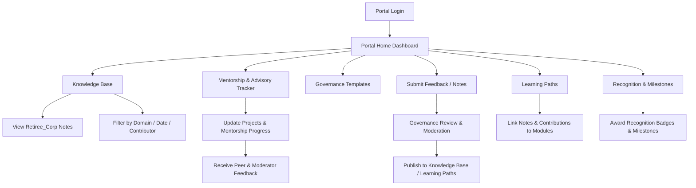

# 🗂 RetireeCorp Portal – Contribution Guide & Internal Notes Workflow

## 📌 Purpose

This guide outlines how authenticated members interact with the **RetireeCorp Portal**, contribute content, and access **Retiree_Corp internal notes** while maintaining governance, ethics, and well-being standards.

The workflow ensures:

* Secure, gated access for authorized users
* Structured knowledge contribution
* Traceable review and approval processes
* Alignment with RetireeCorp values and governance

---

## 1️⃣ Portal Access

### Step 1 – Authentication

1. Members sign in via the **Portal - Authenticated Users** hub.
2. Access is granted based on **membership type**:

   * Retiree / Expert Contributor
   * Organization / Advisory Partner
3. Two-factor authentication (optional) is recommended for sensitive content.

### Step 2 – Dashboard Overview

Upon login, users see the **Portal Home Dashboard** with:

* Knowledge Base
* Learning Paths
* Governance Templates
* Mentorship & Advisory Tracker
* Recognition & Milestones
* Feedback / Notes Submission

---

## 2️⃣ Accessing Retiree_Corp Notes

1. Navigate to **Knowledge Base → Retiree_Corp Internal Notes**.
2. Users can **view**, **search**, and **filter notes** by:

   * Topic / Domain
   * Date Added
   * Contributor / Author
3. Sensitive notes are **read-only** unless explicitly assigned for editing.
4. Notes link directly to relevant **learning paths** or **governance templates** for context.

> 🔒 Governance Note: All Retiree_Corp content is protected under RetireeCorp ethics and confidentiality policies.

---

## 3️⃣ Contributing Notes & Resources

### Step 1 – Identify Contribution

Members may submit:

* New insights from experience
* Updated templates or frameworks
* Case studies or lessons learned
* AI collaboration best practices

### Step 2 – Submission Workflow

1. Click **Submit Feedback / Notes** on the portal dashboard.
2. Complete the **Contribution Form**:

   * Title & Category
   * Brief Description / Context
   * Attach supporting resources (PDF, CSV, code snippets)
   * Tags / Keywords
3. Submit for **review by Governance Team / Portal Moderators**.

### Step 3 – Review & Approval

* Submissions are evaluated for:

  * Accuracy and credibility
  * Alignment with RetireeCorp ethics & governance
  * Relevance to existing notes or learning paths
* Approved contributions are **published in the Knowledge Base** and linked to applicable **Learning Paths**.

---

## 4️⃣ Mentorship & Advisory Updates

Members engaged in projects or mentorships can:

* Update progress in **Mentorship & Advisory Tracker**
* Upload deliverables, guidance notes, or reflections
* Receive **feedback from peers or governance moderators**
* Achieve recognition milestones for contributions

---

## 5️⃣ Learning Path Integration

* Notes and contributions automatically **link to learning modules**.
* Cross-domain insights are tagged for **exploration and knowledge sharing**.
* AI-related notes are reviewed under the **Human-Centric AI Engagement** policy.

---

## 6️⃣ Recognition & Milestones

* Active contributors earn **recognition badges** and are celebrated in the portal.
* Milestones track:

  * Notes submitted
  * Mentorship hours
  * Advisory projects completed
* Highlights are shared in **Community Events** and the public-facing **Milestones & Recognition page**.

---

## 7️⃣ Portal Workflow Diagram (Mermaid)

---

## 🔹 Summary of Portal Contribution Workflow

1. Members **login** → access the **dashboard**.
2. Explore **Knowledge Base** → view internal notes.
3. **Submit contributions** → undergo review → approved content is **published**.
4. **Mentorship & Advisory Tracker** keeps projects organized and aligned with governance.
5. Contributions feed into **Learning Paths** and **Recognition Milestones**.
6. Portal ensures **security, ethics, well-being**, and **structured impact**.

---

This artifact is **ready to be committed** to your **Project NeverTiree repository**, providing a **clear, step-by-step guide** for authenticated portal members.

