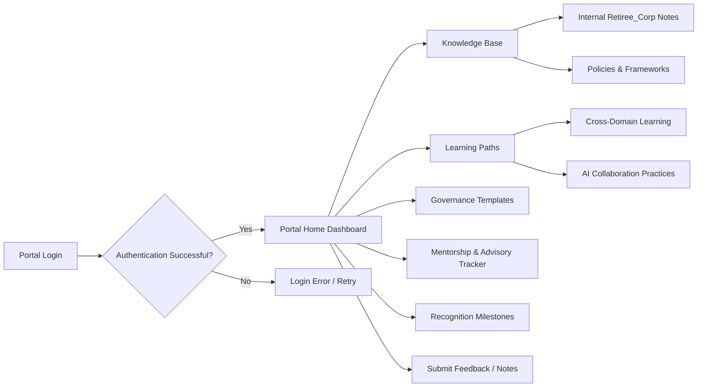

# 🧭 Project NeverTiree

## Strategic Planning & Platform Blueprint

**Project NeverTiree** is the public planning repository for *RetireeCorp* — a purpose-driven ecosystem for retired professionals to contribute wisdom, mentor, and engage meaningfully while preserving holistic well-being.

This repository focuses on **strategic planning, website architecture, portal design, governance, and content flow**.

Notes and internal artifacts are maintained in the [Retiree_Corp repository](https://github.com/seanwhs/Retiree_Corp).

---

## 1. Executive Summary

RetireeCorp is a **values-driven ecosystem** for retirees to:

* Share expertise
* Mentor new professionals
* Provide advisory services
* Participate in lifelong learning
* Access curated knowledge via an authenticated portal

The portal consolidates **Retiree_Corp content** and internal planning notes, providing verified users with structured insights and resources.

---

## 2. Foundational Philosophy

RetireeCorp rests on **five pillars**:

1. **Sustainable Excellence** – Contribution without sacrificing well-being
2. **Purposeful Contribution** – Impact over metrics
3. **Governance & Ethical Discipline** – Structured, trustworthy decision-making
4. **Human-Centric AI Collaboration** – Tech enhances, not replaces, human wisdom
5. **Lifelong Growth** – Retirement as a platform for reflection and cross-domain learning

---

## 3. Website Content & Structure

### 🏠 Homepage

**Headline:** Where Experience Meets Purpose Beyond Retirement
**Subheadline:** A vibrant community of retirees contributing wisdom, mentoring the next generation, and doing meaningful work without sacrificing well-being

**CTAs:**

* [Join the Community]
* [Engage a Retiree Expert]
* [Access Portal]

---

### Core Messaging Sections

#### Our Purpose

> “We exist to create meaningful impact while maintaining holistic well-being.”

* Sustainable excellence
* Purposeful contribution
* Balance between work and life
* Human-first technology
* Structured wisdom transfer

#### What We Offer

* Community of retired professionals
* Mentorship & teaching participation
* Consultancy & advisory engagements
* Lifelong learning resources
* Recognition programs & milestones
* **Authenticated portal with curated Retiree_Corp content**

#### Community Values

* Human-centric work policies
* Ethical AI engagement
* Cross-domain collaboration
* Health, rest, and family first
* Governance-based decision-making

---

### How It Works

#### For Retirees

1. Join the community
2. Choose contribution path (Mentor, Advisor, Practitioner, Thought Leader)
3. Maintain a sustainable pace
4. Access portal content for learning and internal notes

#### For Organizations

1. Post a challenge, advisory need, or mentorship opportunity
2. Get matched with professionals
3. Execute via structured governance
4. Access portal knowledge as needed

---

## 4. Core Platform Domains

### 🌱 Community

* Purpose & values
* Well-being focus
* Member stories
* Recognition milestones
* Portal: curated internal notes

### 👔 Work & Engagement

* Advisory services
* Mentorship programs
* Consulting engagements
* Project governance assistance
* Portal: internal templates & guidelines

### 📚 Learning Pathways

* Learning Paths
* Lifelong Learning
* Resources
* Cross-Domain Exploration
* Portal: curated Retiree_Corp notes

### 📋 Policies & Governance

* Governance policies
* Ethical norms
* Decision-making frameworks
* AI stewardship
* Conflict-of-interest & confidentiality standards

---

## 5. Visual Site Map (Mermaid Diagram)

```mermaid
flowchart TD
    A[Home] --> B[About]
    B --> B1[Mission & Values]
    B --> B2[Community Purpose]
    B --> B3[Core Principles]

    A --> C[Founder]
    C --> C1[Founder Story]
    C --> C2[Vision Behind RetireeCorp]
    C --> C3[Professional Background]

    A --> D[Join the Community]
    D --> D1[For Retirees]
    D --> D2[Eligibility & Guidelines]
    D --> D3[Sign Up]

    A --> E[Engagement]
    E --> E1[Mentorship Programs]
    E --> E2[Consultancy & Advisory]
    E --> E3[Projects & Opportunities]
    E --> E4[How It Works]

    A --> F[Learning]
    F --> F1[Learning Paths]
    F --> F2[Cross-Domain Exploration]
    F --> F3[Resources Library]

    A --> G[Policies]
    G --> G1[Governance]
    G --> G2[Ethics & AI Stewardship]
    G --> G3[Well-Being Practices]
    G --> G4[Decision-Making Frameworks]

    A --> H[Milestones & Recognition]
    A --> I[Blog & Insights]
    A --> J[FAQ]
    A --> K[Portal - Authenticated Users]
    K --> K1[Retiree_Corp Notes]
    K --> K2[Internal Resources]
    K --> K3[Learning Paths]
    K --> K4[Governance Templates]

    A --> L[Contact]
```

---

## 6. Portal Flow Diagram (Mermaid)

---

## 7. Founder Section

**Founder:** Technology professional with expertise in:

* Enterprise architecture
* Governance frameworks
* System integration & modernization
* Structured decision-making in complex environments

**Mission:** Preserve institutional knowledge, enable structured contribution, and maintain well-being for retirees.

---

## 8. Strategic Positioning

RetireeCorp = **Values Ecosystem**, not gig marketplace

* Community portal
* Advisory marketplace
* Thought leadership hub
* Lifelong learning library
* Governance-based trust framework
* **Authenticated portal with curated Retiree_Corp content**

---

## 9. Long-Term Strategic Potential

* Global chapters
* Certification for verified experience
* Advisory councils
* University & corporate partnerships
* AI ethics consortium
* Governance think tank

---

## 10. Closing Philosophy

RetireeCorp is not about staying busy.
It is about **staying meaningful**.

* Preserves experience
* Protects well-being
* Structures wisdom
* Sustains contribution

> Experience does not retire; it **matures into guidance**.

